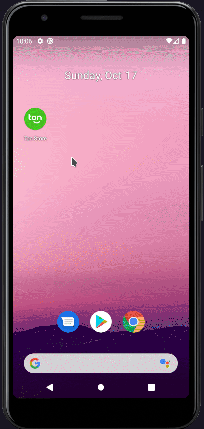
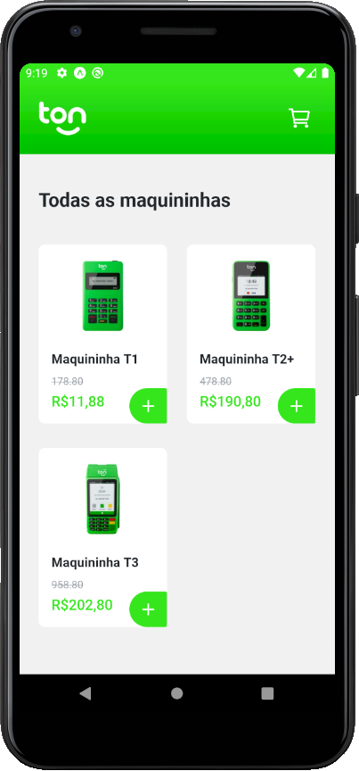
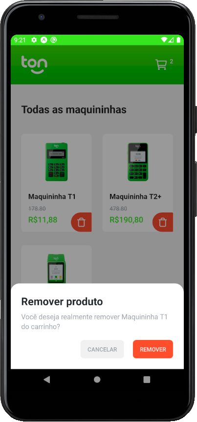
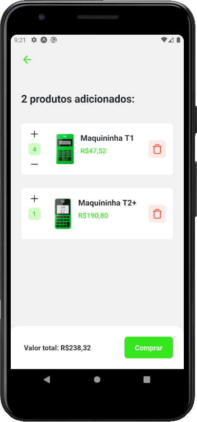
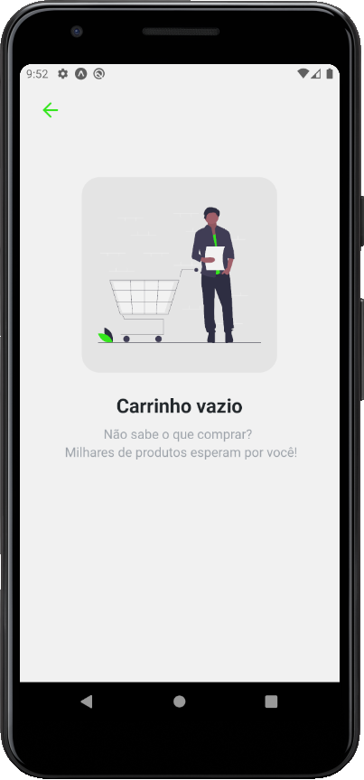

<h4 align="center">
    
</h4>

## Índice

- [Sobre](#sobre)
- [Tecnologias Utilizadas](#tecnologias-utilizadas)
- [Layout](#layout)
- [Resultado](#resultado)
- [Pré-requisitos](#pre-requisitos)
- [Como Usar](#como-usar)
- [Observaões](#observacoes)

## :bookmark: Sobre

Este repositório é o resultado do app desenvolvido no **desafio técnico** para desenvolvedor mobile da [Ton]()

## :rocket: Tecnologias Utilizadas

Esse projeto foi desenvolvido com as seguintes tecnologias:

- [Typescript](https://www.typescriptlang.org/)
- [React Native](https://reactnative.dev/)

## 💅 Layout

O layout do desafio era livre, então acabei criando um do zero no [Figma](https://www.figma.com/file/awEiMPoQQtSz5a4QIrDHrb/Ton-store)

## 📷 Resultado

<h1 align="center">
  
  
  
  
  
</h1>

## :fire: Pré-requisitos

Para rodar este projeto é necessário ter instalado na sua máquina as seguntes tecnologias:

- [Node.js](https://nodejs.org/en/)
- [Yarn](https://yarnpkg.com/)
- [Expo](https://expo.dev/)

## :zap: Como usar

1. Faça um clone desse repositório: `git clone https://github.com/vitorserrano/naveteam-mobile-challange.git`
2. Instale as dependências: `yarn`
3. Startar a aplicação: `yarn start`
4. Rode o aplicativo: `yarn android`

## 📝 Observações

- Acabei optando por criar um arquivo no gist para utilizar como "API", por conta disso existem alguns "setTimeout" para poder simular um pouco da demora das APIs convencionais.

<h4 align="center">
    Feito com 💜 por <a href="https://www.linkedin.com/in/vitor-serrano/" target="_blank">Vitor Serrano</a>
</h4>
